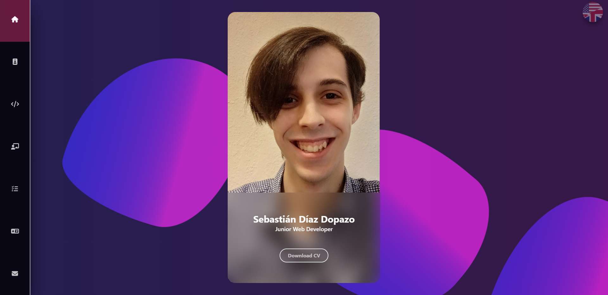

# Sebastián Díaz Dopazo || sebadio

`Desarrollador Web y estudiante de programación`

Bienvenido a mi perfil de GitHub, aca podes encontrar todos los proyectos en los que trabaje, ya sea individual o grupalmente.

---

### Lenguajes y herramientas

 

#

Te invito a investigar mas sobre mi en mi [Portafolio](https://sebadio.github.io/Portafolio/).

#
